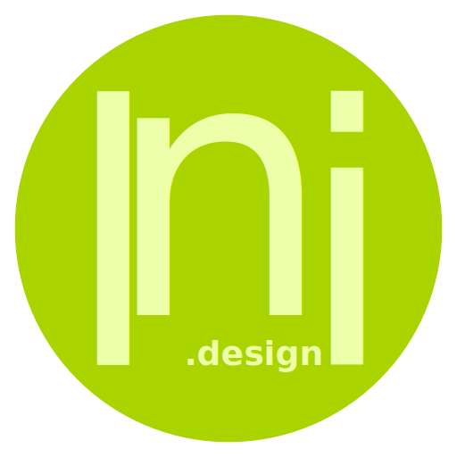

## 🖼️ Vorschau

## 📄 Technische Details

- Format: SVG (Scalable Vector Graphics)
- Farbe: Monochrom (Schwarz)
- Skalierbar & für Print sowie Web geeignet
- Keine eingebetteten Fonts, kein Script

## 📝 Hinweise

- Dieses Repository dient als zentrale Ablage der aktuell verwendeten Logodatei.
- Änderungen am Logo werden im Verlauf der Designentwicklung dokumentiert.
- Nur autorisierte Änderungen. Für neue Varianten (Farben, Icons, etc.) bitte Branch anlegen oder Issue eröffnen.

---

## 📓 Logbuch

**23.03.2025**  
✓ Initialer Upload der SVG-Datei  
✓ Erste Dokumentation erstellt (README.md)  

---

> lni.design – Creativity Solutions Worldwide.
